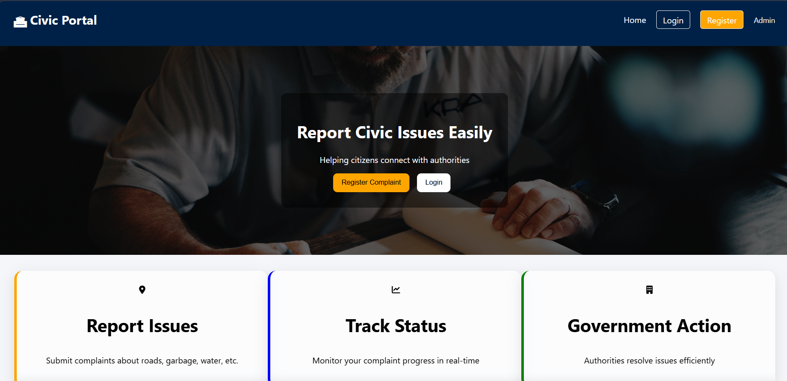
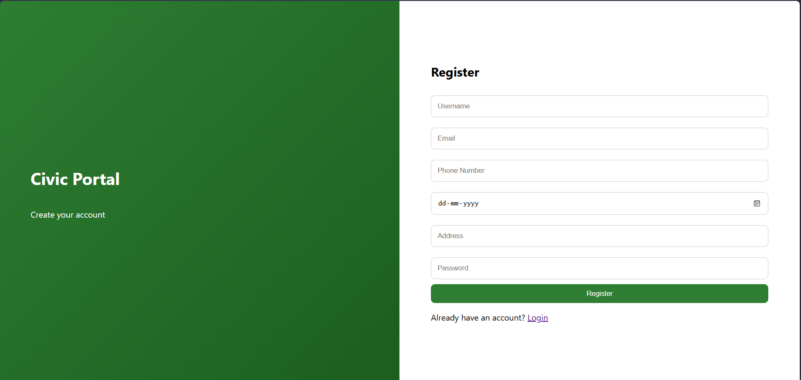
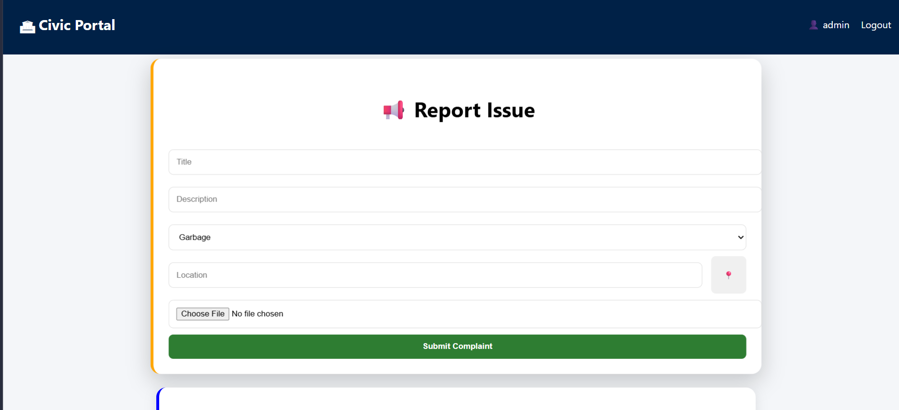
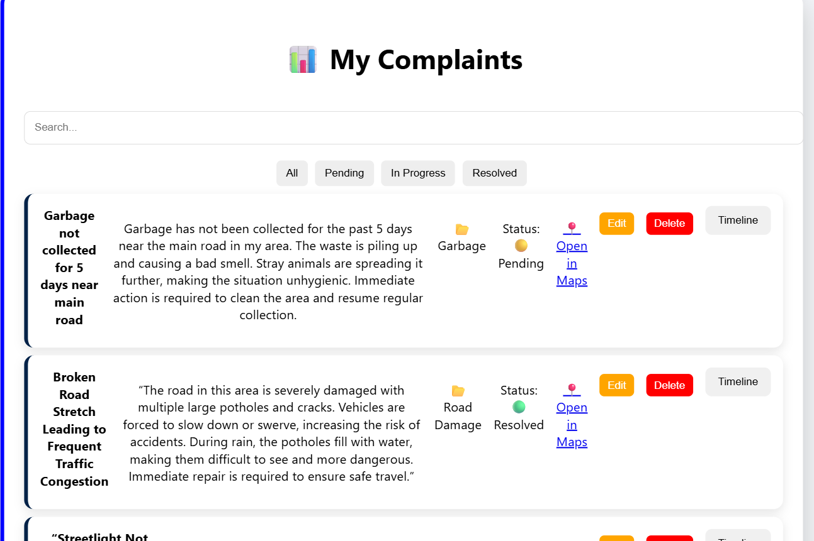
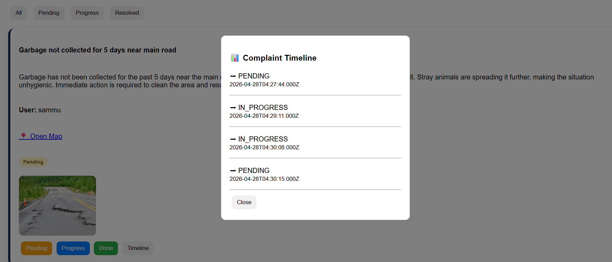
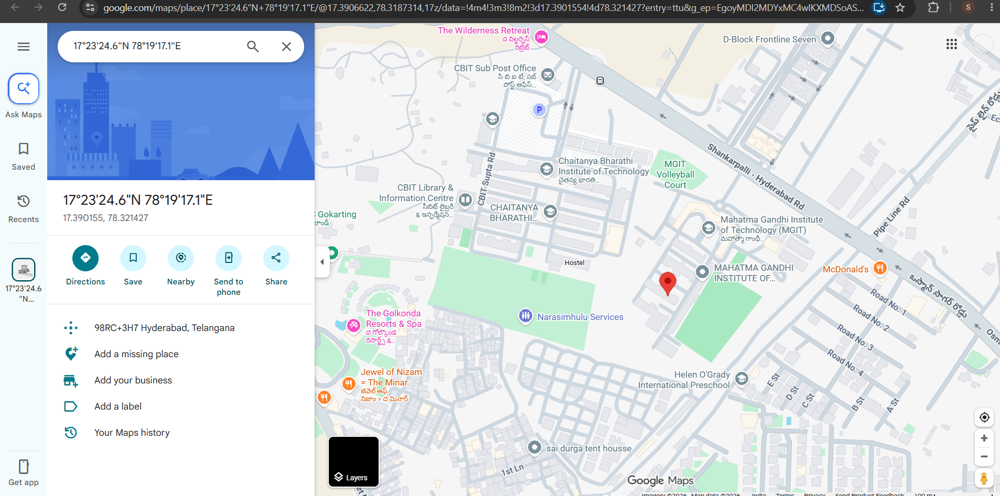
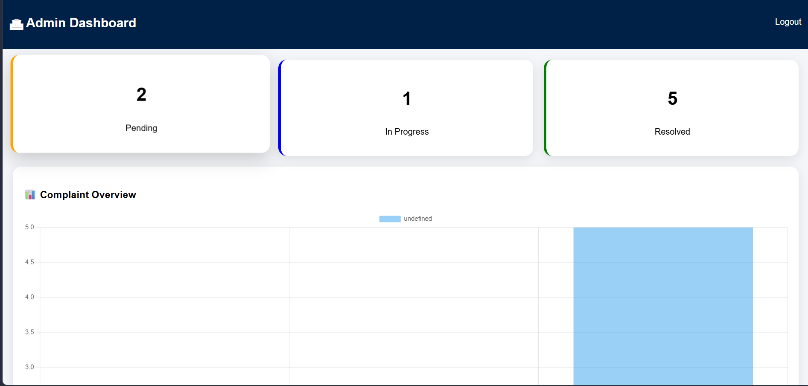

# 🏙️ Civic Issue Reporting and Resolution System

## Overview

The Civic Issue Reporting and Resolution System is a web-based platform that enables citizens to report public issues such as potholes, garbage accumulation, water leakage, drainage problems, and streetlight failures. The system allows users to submit complaints with images and live location details, track complaint status, and receive updates. Administrators can manage complaints, update statuses, and monitor issue resolution.

This project aims to improve communication between citizens and local authorities through a centralized digital complaint management system.

---

## Technologies Used

### Frontend

* HTML
* CSS
* JavaScript

### Backend

* Node.js
* Express.js

### Database

* MySQL

### Additional Technologies

* JWT Authentication
* File Uploads
* Live Location Tracking
* Google Maps Integration

---

## Key Features

### User Module

* User Registration
* User Login
* Report Civic Issues
* Upload Complaint Images
* Share Live Location
* Track Complaint Status
* View Complaint History

### Admin Module

* Admin Login
* View All Complaints
* Update Complaint Status
* Monitor Issue Resolution
* Manage User Complaints

### System Features

* Secure Authentication
* Image Upload Support
* Live Location Integration
* Complaint Timeline Tracking
* Responsive User Interface

---

## Project Structure

```text
CIVIC FINAL/
│
├── client/
├── server/
├── screenshots/
│   ├── home.png
│   ├── login.png
│   ├── register.png
│   ├── report_issue.png
│   ├── user_dashboard.png
│   ├── complaint_status.png
│   ├── live_location.png
│   └── admin_dashboard.png
│
├── README.md
└── .gitignore
```

---

## Screenshots

### Home Page



### Login Page


### Registration Page



### Report Issue



### User Dashboard



### Complaint Status Tracking



### Live Location Tracking



### Admin Dashboard



---

## Installation

### Clone the Repository

```bash
git clone <your-github-repository-link>
```

### Install Dependencies

```bash
npm install
```

### Configure Database

1. Create a MySQL database.
2. Import the required tables.
3. Update database credentials in the server configuration file.

### Run the Application

```bash
npm start
```

### Open in Browser

```text
http://localhost:3000
```

---

## Future Enhancements

* Mobile Application Support
* Real-Time Notifications
* AI-Based Issue Classification
* Priority-Based Complaint Handling
* Analytics Dashboard
* Government Portal Integration

---

## Author

**Sameela Rathnagari**

B.Tech – Computer Science and Engineering
Mahatma Gandhi Institute of Technology (MGIT)

---

## License

This project is developed for educational and learning purposes.
